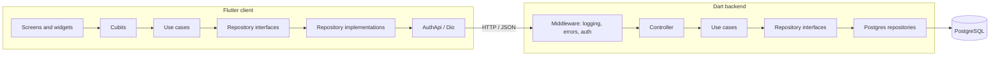
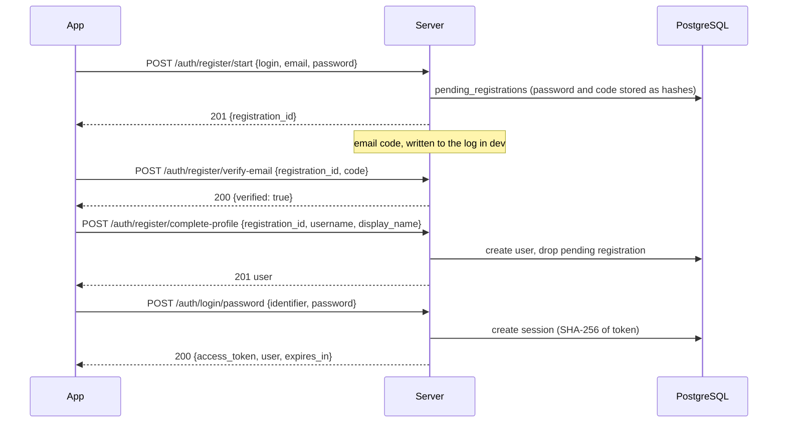

<div align="center">

# Void

**A private messenger built from scratch: a Flutter client and a hand-written Dart backend on PostgreSQL. The authentication layer is finished end to end; real-time chat is the next milestone.**


Android · iOS · Web · Windows · macOS · Linux (Flutter targets) — developed and tested on Android

🇬🇧 English · [🇷🇺 Русский](README.ru.md)


</div>

> [!NOTE]
> **Status: paused.** Void is a personal project with no deadline. Work is on hold while I focus on another project. Done: the whole authentication block on the client and on the server. Not done: chats, messages and real-time delivery — the part the project was started for. See [What is left](#what-is-left).

<details>
<summary><b>More screenshots</b></summary>

<br>

| Registration, step 3 |
| :---: |
|  |
| Public profile: username and display name |

</details>

## At a glance

| | |
| --- | --- |
| Client code (hand-written Dart) | ~4,200 lines in 100 files |
| Backend code (hand-written Dart) | ~3,200 lines in 78 files |
| Backend tests | 47 tests in 12 files |
| API endpoints | 10 auth endpoints + 2 probes |
| Database | 4 tables, 3 SQL migrations, no ORM |
| Languages in the app | English, Russian |
| Built-in color palettes | 5, each in light and dark |

Generated code (`*.g.dart`, `*.freezed.dart`, `*.gr.dart`, l10n output) is not counted.

## Features

### Onboarding and sign-in (client)

- **Welcome screen** as the entry point for unauthenticated users, with a theme switch and logo and portal artwork that follow the theme.
- **Three-step registration** with a progress indicator:
  1. login, email, password with confirmation, terms-and-conditions checkbox (the link opens in the browser);
  2. 4-digit code from the email, entered in a PIN field;
  3. public profile: username and display name.
- **Safe back navigation:** going back from the profile step asks for confirmation and cancels the pending registration on the server, returning to step one.
- **Two ways to log in:** login/email + password, or a one-time code sent to the email.
- **Resend cooldown** and separate messages for a wrong code, an expired code and too many attempts.
- **Validation on the client** is UX only; the server validates everything again. Cyrillic display names are allowed.
- **Three kinds of identifiers**, each with its own role: *login* (private, used only to sign in), *username* (public `@id`), *display name* (shown in chats). A private login means a forgotten email does not lock you out of the account, and a public handle is not the thing attackers can guess.

### Session handling

- The access token is kept in **secure storage** (Android encrypted shared preferences, iOS Keychain `first_unlock`).
- A Dio **`AuthInterceptor`** adds the token to requests; an **`ErrorInterceptor`** turns network and API errors into typed failures.
- The **auth guard** keeps unauthenticated users on the welcome flow. A guard only runs on navigation, so an expired token is handled by the error interceptor: a `401` triggers a logout through `ISessionExpiredHandler`. Anonymous auth requests are excluded so a failed login does not log you out.

### Look and feel

- Light/dark theme with the system theme as default, persisted between launches.
- A **palette system** in the theme layer: five presets (Brand, Coffee, Ocean, Rose, Forest) and support for custom palettes, with localized palette names. A theme pair (light + dark) is built from any palette.
- **English and Russian** through ARB files and generated `AppLocalizations`; the language is persisted too. Highlighted words inside translations (for example, the colored "secure" and "seamless" on the welcome screen) are done with styled text.
- Adaptive launcher icons for all platforms.
- Space Grotesk font, glow and elevation effects on buttons and logo.

### Backend

- **Registration in three steps** (`start` → `verify-email` → `complete-profile`) with a pending-registration table, plus `cancel`.
- **Passwordless login** by one-time email code, next to password login.
- **Server-side sessions:** opaque access token, stored only as a SHA-256 hash, 30-day lifetime, revoke the current session or all sessions.
- **Email codes:** 15-minute lifetime, attempt counter, 60-second resend cooldown (`429`), and `login/code/request` always answers `sent: true` so the API cannot be used to find out which accounts exist.
- **Passwords:** Argon2id from a pure-Dart implementation.
- **Validation policies:** normalization of fields, blacklists for logins and usernames, all field errors returned in one response.
- **Probes:** `GET /` and `GET /health`, allowed without a token.
- In development the email codes are written to the server log by `DevEmailSender`.

## Architecture

Both projects use the same feature-first Clean Architecture, on purpose: once the idea is clear on one side, the other side reads the same way.



Key decisions:

- **Contract first.** The API contract was written and checked before the client was wired to it; the client talks to the server through a typed `AuthApi`.
- **One use case per action** on the server (`StartRegistration`, `VerifyRegistrationEmail`, `CompleteRegister`, `LoginWithPassword`, `Logout`, …), repository interfaces in the domain layer, DTOs and mappers at the edge.
- **The network layer does not depend on presentation.** The Dio error interceptor calls an `ISessionExpiredHandler` defined in `core`; the implementation calls `AuthCubit.logout`.
- **DI everywhere** with `get_it` + `injectable` (client and server).
- **Shared auth layout** with slots: one skeleton for the auth screens, form sections kept free of buttons, so a form only owns its fields.
- **Models** with `freezed` and `json_serializable` on both sides.

## Registration and login flow



Error envelope used by every endpoint:

```json
{
  "success": false,
  "error": {
    "code": "VALIDATION_FAILED",
    "message": "Human-readable explanation",
    "details": [
      { "field": "password", "code": "INVALID_PASSWORD", "message": "..." }
    ]
  }
}
```

| Method | Path | Auth | Purpose |
| --- | --- | --- | --- |
| POST | `/auth/register/start` | – | create a pending registration, send the code |
| POST | `/auth/register/verify-email` | – | confirm the code |
| POST | `/auth/register/complete-profile` | – | create the user from a verified registration |
| POST | `/auth/register/cancel` | – | drop a pending registration |
| POST | `/auth/login/password` | – | login or email + password |
| POST | `/auth/login/code/request` | – | send a one-time login code |
| POST | `/auth/login/code/verify` | – | exchange the code for a session |
| GET | `/auth/me` | Bearer | current user |
| POST | `/auth/logout` | Bearer | revoke the current session |
| POST | `/auth/logout/all` | Bearer | revoke all sessions of the user |

## Backend details

- **Request path:** `readAsString` → `jsonDecode` → request DTO → mapper → domain entity → repository → SQL → response DTO.
- **Middleware pipeline:** Talker request logging → error middleware (typed exceptions to the error envelope) → Bearer auth with a whitelist of public routes.
- **Errors:** request-schema errors (`INVALID_JSON`, `INVALID_BODY`, `INVALID_REQUEST_FIELDS`) are kept apart from domain validation (`VALIDATION_FAILED`). Postgres error codes are mapped to domain errors: a unique violation becomes `EMAIL_TAKEN` or `USERNAME_TAKEN`.
- **PostgreSQL without an ORM:** plain SQL with named parameters (the driver substitutes values, which closes the door on SQL injection) and `RETURNING` to avoid a second query. Connection **pool** registered in DI.
- **Graceful shutdown** on `SIGINT` and `SIGTERM`, closing the server and the pool.
- **Migrations** are append-only SQL files: `auth.users`, `auth.sessions`, `auth.pending_registrations`, `auth.login_email_codes`, with indexes on expiry columns and a partial index on active codes.
- **Postman:** collections for auth and app endpoints plus a `Void` environment with `baseUrl` and token variables.
- **Docker Compose** with PostgreSQL 16 for local development.

## Testing

47 backend unit tests in 12 files, none of them needs a database:

- every auth endpoint (register start / verify / complete / cancel, login by password, code request, code verify, me, logout) through the real router with fake use cases;
- input validation for profile completion;
- the auth middleware, including public routes and protected routes;
- the DI application module.

The Flutter client has no automated tests yet.

## Project history

| When (2026) | What happened |
| --- | --- |
| 12 Apr | First idea of a messenger as a project that covers real-time, BLoC, a custom backend and full auth |
| 2–3 May | Name chosen: Void. A package named `void` is impossible, since `void` is a Dart keyword, so the package is `void_chat` |
| 3–4 May | Repository created, launcher icons, switch to a monorepo with a Dart backend, localization and routing foundations |
| 5 May | Light/dark themes, palette system, locale and theme cubits, preferences storage, auth cubit with route guard |
| 6–7 May | Backend DI and entrypoint, Docker Compose, app module, connection pool, logging middleware |
| 8–9 May | Auth feature in Clean Architecture, error handling, Argon2id (pure Dart, after the native binding broke on Dart 3), validation and blacklist policies, first tests |
| 10–11 May | SQL migrations, login data layer, documented API contract |
| 13–15 May | Login and registration screens, verify-email UI, shared auth scaffold, progress indicator |
| 16–18 May | Welcome onboarding, branding polish, multi-step registration on the server |
| 19 May | Profile completion, email-code login, `/auth/me`, logout, health endpoints, auth middleware |
| 20–21 May | Postman collections, Dio client and interceptors, password login and code login in the app, resend cooldown, shared verify-email module |
| 22–24 May | Registration connected end to end, cancel flow, Cyrillic names, PIN entry, merge of the `dev` branch |

## What I learned

**Where I started.** Two Flutter projects behind me; state management with Provider and Riverpod, go_router, Supabase. Never touched BLoC, a custom backend or a full authentication flow.

**Where I ended up**

| Area | Result |
| --- | --- |
| State management | BLoC/Cubit, the last of the three big options for me |
| Dependency injection | `get_it` + `injectable` (`@lazySingleton`, `@preResolve`) on client and server |
| Navigation | `auto_route` with guards, nested routes and a safe cyclic login ↔ registration flow |
| Backend | Own server on `shelf`: routing, middleware, DI, graceful shutdown |
| Database | Plain SQL on PostgreSQL, connection pool, migrations, error-code mapping |
| Security | Argon2id, hashed tokens and codes, no account enumeration, rate-limited resend, client validation for UX and server validation for safety |
| UI composition | A layout skeleton with slots instead of one universal widget with many flags |
| Tooling | Postman collections, Docker Compose, code generation on both sides |

**What changed in how I work.** I now choose a project by the list of topics it closes, not by "what else to write". I start from the contract, not from the UI. I would also start from the topic I came for: a WebSocket echo between client and server first, authentication after it.

## Why the project is paused

Void is a project for myself, with no customer and no deadline. When another project needed my time, Void stopped at the end of its authentication block. That part is complete and tested; the real-time part was the next step and is waiting.

## Tech stack

| Layer | Technologies |
| --- | --- |
| State and logic | `flutter_bloc` (Cubit), `equatable`, `flutter_hooks` |
| Navigation | `auto_route` with a guard |
| DI | `get_it`, `injectable` |
| Network | `dio` with auth and error interceptors, `talker_dio_logger` |
| Storage | `flutter_secure_storage`, `shared_preferences` behind `AppPrefs` |
| UI | `pinput`, `styled_text`, `flutter_colorpicker`, `url_launcher`, Space Grotesk, `flutter_launcher_icons` |
| Localization | `flutter_localizations`, `intl`, ARB, `flutter_localized_locales` |
| Models | `freezed`, `json_serializable` |
| Server | `shelf`, `shelf_router`, `postgres` (pool), `argon2`, `crypto`, `dotenv` |
| Logging | `talker`, `talker_flutter`, `talker_bloc_logger` |
| Infra | PostgreSQL 16, Docker Compose, Postman |
| Quality | `flutter_lints`, `lints`, `test`, `build_runner` |

## Project structure

```
void-chat/
├── backend/
│   ├── bin/server.dev.dart          # entrypoint: pipeline, server, graceful shutdown
│   ├── lib/src/
│   │   ├── core/                    # DI, JSON responses, app exceptions, Postgres error mixin
│   │   ├── middleware/              # logging, errors, auth
│   │   └── features/
│   │       ├── auth/                # login, register, logout, me — each split into api/domain/data
│   │       └── chat/                # conversations: placeholder for the next milestone
│   ├── migrations/                  # append-only SQL migrations
│   ├── postman/                     # collections and the Void environment
│   └── test/unit/                   # endpoint, middleware and DI tests
├── frontend/
│   └── lib/
│       ├── app/  router/            # app root, auto_route, auth guard
│       ├── core/                    # network, storage, theme and palettes, l10n, layouts, DI
│       └── features/
│           ├── auth/                # welcome, login, register, shared widgets
│           ├── chat/                # chat list, new chat, shared layers: folder skeleton only
│           └── home/                # placeholder home screen
├── docker/                          # docker-compose for PostgreSQL
└── project_screenshots/
```

## What is left

- [ ] Conversations list and new-chat flow
- [ ] Messages: send, history, delivery
- [ ] Real-time transport (WebSocket) and Streams in the UI
- [ ] Push notifications and background work
- [ ] Media, online and typing statuses
- [ ] Password recovery: the "Forgot password?" link is in the UI, the flow is not built
- [ ] Profile and settings, including the palette picker (palettes are implemented in the theme layer; the screen to choose them is not)
- [ ] Real email delivery (SMTP) instead of the development log
- [ ] Automatic retry for transient Postgres errors (marked as TODO in the code)
- [ ] Production configuration: API URL from the environment, production entrypoint, CI
- [ ] Flutter widget and integration tests
