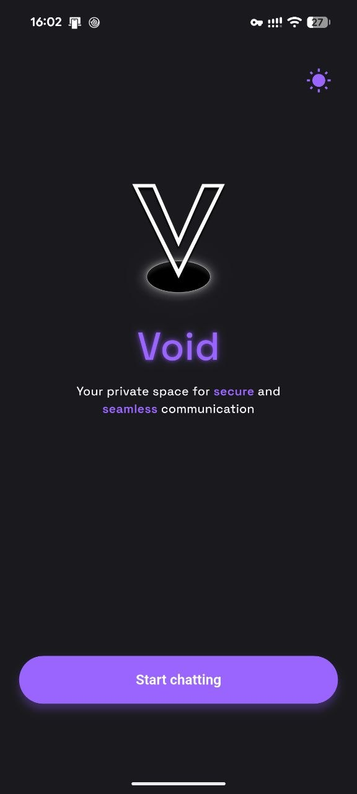
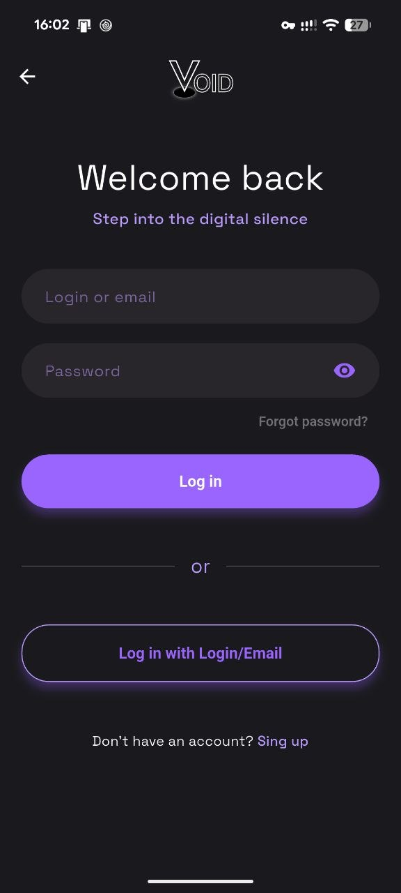
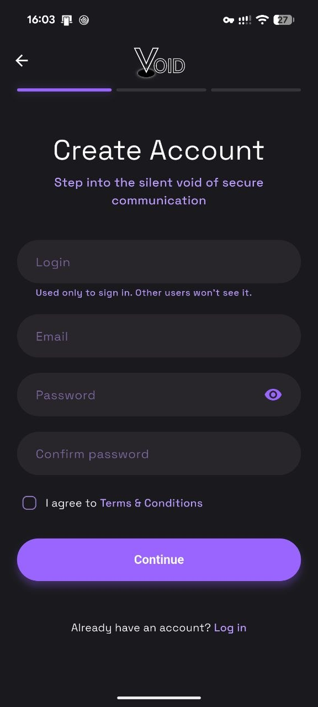
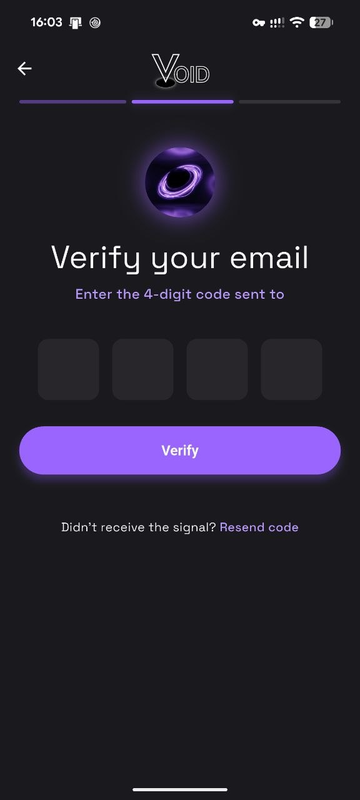
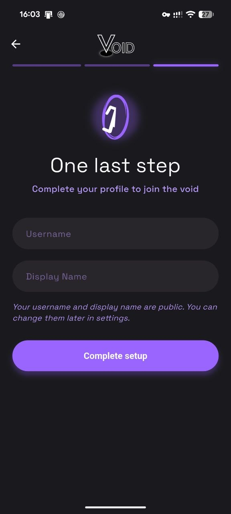
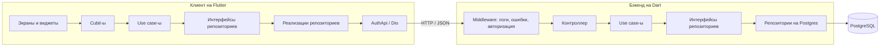
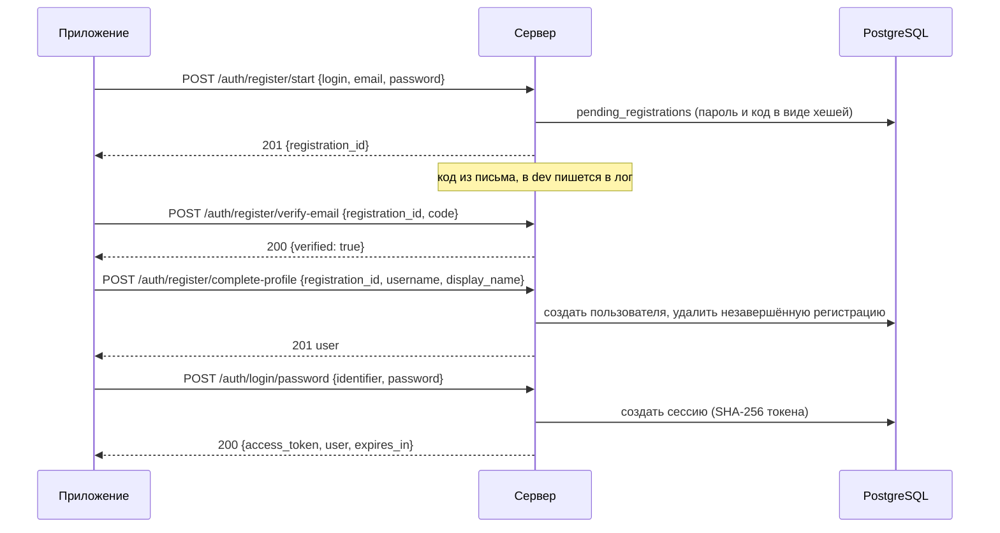

<div align="center">

# Void

**Приватный мессенджер, написанный с нуля: клиент на Flutter и собственный бэкенд на Dart с PostgreSQL. Аутентификация завершена от клиента до базы; чат в реальном времени — следующий этап.**


Android · iOS · Web · Windows · macOS · Linux (платформы Flutter) — разрабатывалось и проверялось на Android

[🇬🇧 English](README.md) · 🇷🇺 Русский






</div>

> [!NOTE]
> **Статус: на паузе.** Void — личный проект без дедлайна. Работа приостановлена, пока я занимаюсь другим проектом. Сделано: весь блок аутентификации на клиенте и на сервере. Не сделано: чаты, сообщения и доставка в реальном времени — то, ради чего проект и начинался. См. [Что осталось](#что-осталось).

<details>
<summary><b>Ещё скриншоты</b></summary>

<br>

| Регистрация, шаг 3 |
| :---: |
|  |
| Публичный профиль: username и отображаемое имя |

</details>

## Коротко в цифрах

| | |
| --- | --- |
| Код клиента (написанный вручную Dart) | ~4 200 строк в 100 файлах |
| Код бэкенда (написанный вручную Dart) | ~3 200 строк в 78 файлах |
| Тесты бэкенда | 47 тестов в 12 файлах |
| API | 10 auth-эндпоинтов + 2 для проб |
| База данных | 4 таблицы, 3 SQL-миграции, без ORM |
| Языки приложения | английский, русский |
| Встроенные палитры | 5, каждая в светлой и тёмной теме |

Сгенерированный код (`*.g.dart`, `*.freezed.dart`, `*.gr.dart`, выход l10n) не учитывался.

## Возможности

### Онбординг и вход (клиент)

- **Welcome-экран** как точка входа для неавторизованных пользователей: переключатель темы, логотип и «портал» подстраиваются под тему.
- **Регистрация в три шага** с индикатором прогресса:
  1. логин, почта, пароль с подтверждением, чекбокс условий использования (ссылка открывается в браузере);
  2. 4-значный код из письма в PIN-поле;
  3. публичный профиль: username и отображаемое имя.
- **Безопасный возврат назад:** с шага профиля приложение просит подтверждение и отменяет незавершённую регистрацию на сервере, возвращая на первый шаг.
- **Два способа входа:** логин/почта + пароль или одноразовый код на почту.
- **Таймер повторной отправки** и отдельные сообщения для неверного кода, просроченного кода и превышения числа попыток.
- **Валидация на клиенте** — это UX; сервер проверяет всё заново. Разрешены кириллические отображаемые имена.
- **Три идентификатора с разными ролями:** *login* (приватный, нужен только для входа), *username* (публичный `@id`), *display name* (имя в чатах). Приватный логин не даёт потерять аккаунт, если забыта почта, а публичный идентификатор не становится тем, что можно подбирать.

### Работа с сессией

- Токен доступа хранится в **защищённом хранилище** (encrypted shared preferences на Android, Keychain `first_unlock` на iOS).
- **`AuthInterceptor`** для Dio подставляет токен в запросы, **`ErrorInterceptor`** превращает сетевые и API-ошибки в типизированные сбои.
- **Auth guard** держит неавторизованного пользователя в welcome-потоке. Guard срабатывает только при навигации, поэтому протухший токен обрабатывает интерсептор ошибок: `401` вызывает выход через `ISessionExpiredHandler`. Анонимные auth-запросы исключены, чтобы неудачный вход не разлогинивал.

### Внешний вид

- Светлая/тёмная тема, по умолчанию системная, выбор сохраняется между запусками.
- **Система палитр** в слое темы: пять пресетов (Brand, Coffee, Ocean, Rose, Forest) и поддержка пользовательских палитр, названия палитр локализованы. Из любой палитры строится пара тем (светлая + тёмная).
- **Английский и русский** через ARB-файлы и сгенерированный `AppLocalizations`; язык тоже сохраняется. Выделенные слова внутри переводов (например, цветные «secure» и «seamless» на welcome-экране) сделаны через styled text.
- Адаптивные иконки приложения для всех платформ.
- Шрифт Space Grotesk, свечение и тени у кнопок и логотипа.

### Бэкенд

- **Регистрация в три шага** (`start` → `verify-email` → `complete-profile`) с таблицей незавершённых регистраций, плюс `cancel`.
- **Вход без пароля** по одноразовому коду из письма, рядом со входом по паролю.
- **Серверные сессии:** непрозрачный токен доступа, в базе только SHA-256 хеш, срок жизни 30 дней, завершение текущей или всех сессий.
- **Коды из писем:** срок жизни 15 минут, счётчик попыток, пауза 60 секунд между отправками (`429`); `login/code/request` всегда отвечает `sent: true`, поэтому API нельзя использовать, чтобы узнать, какие аккаунты существуют.
- **Пароли:** Argon2id, реализация на чистом Dart.
- **Политики валидации:** нормализация полей, чёрные списки для логинов и username, все ошибки полей возвращаются одним ответом.
- **Пробы:** `GET /` и `GET /health`, доступны без токена.
- В разработке коды из писем пишутся в лог сервера через `DevEmailSender`.

## Архитектура

В обоих проектах одна и та же feature-first Clean Architecture, и это сделано осознанно: понятая на одной стороне идея читается так же на другой.



Ключевые решения:

- **Сначала контракт.** API-контракт был описан и проверен до подключения клиента; клиент общается с сервером через типизированный `AuthApi`.
- **Один use case на действие** на сервере (`StartRegistration`, `VerifyRegistrationEmail`, `CompleteRegister`, `LoginWithPassword`, `Logout` и т. д.), интерфейсы репозиториев в домене, DTO и мапперы на границе.
- **Сетевой слой не зависит от презентации.** Dio-интерсептор ошибок вызывает `ISessionExpiredHandler` из `core`; реализация вызывает `AuthCubit.logout`.
- **DI везде:** `get_it` + `injectable` на клиенте и на сервере.
- **Общий auth-layout со слотами:** один каркас для auth-экранов, кнопки вынесены из секций форм, чтобы форма отвечала только за свои поля.
- **Модели** на `freezed` и `json_serializable` с обеих сторон.

## Поток регистрации и входа



Единый формат ошибок для всех эндпоинтов:

```json
{
  "success": false,
  "error": {
    "code": "VALIDATION_FAILED",
    "message": "Понятное описание",
    "details": [
      { "field": "password", "code": "INVALID_PASSWORD", "message": "..." }
    ]
  }
}
```

| Метод | Путь | Авторизация | Назначение |
| --- | --- | --- | --- |
| POST | `/auth/register/start` | – | создать незавершённую регистрацию, отправить код |
| POST | `/auth/register/verify-email` | – | подтвердить код |
| POST | `/auth/register/complete-profile` | – | создать пользователя из подтверждённой регистрации |
| POST | `/auth/register/cancel` | – | отменить незавершённую регистрацию |
| POST | `/auth/login/password` | – | логин или почта + пароль |
| POST | `/auth/login/code/request` | – | отправить одноразовый код для входа |
| POST | `/auth/login/code/verify` | – | обменять код на сессию |
| GET | `/auth/me` | Bearer | текущий пользователь |
| POST | `/auth/logout` | Bearer | завершить текущую сессию |
| POST | `/auth/logout/all` | Bearer | завершить все сессии пользователя |

## Бэкенд подробнее

- **Путь запроса:** `readAsString` → `jsonDecode` → DTO запроса → маппер → доменная сущность → репозиторий → SQL → DTO ответа.
- **Цепочка middleware:** логирование запросов (Talker) → middleware ошибок (типизированные исключения в единый формат) → Bearer-авторизация с белым списком публичных маршрутов.
- **Ошибки:** ошибки схемы запроса (`INVALID_JSON`, `INVALID_BODY`, `INVALID_REQUEST_FIELDS`) отделены от доменной валидации (`VALIDATION_FAILED`). Коды ошибок Postgres преобразуются в доменные: нарушение уникальности превращается в `EMAIL_TAKEN` или `USERNAME_TAKEN`.
- **PostgreSQL без ORM:** чистый SQL с именованными параметрами (значения подставляет драйвер, что закрывает SQL-инъекции) и `RETURNING`, чтобы не делать второй запрос. **Пул соединений**, зарегистрированный в DI.
- **Graceful shutdown** по `SIGINT` и `SIGTERM` с закрытием сервера и пула.
- **Миграции** — append-only SQL-файлы: `auth.users`, `auth.sessions`, `auth.pending_registrations`, `auth.login_email_codes`, с индексами по срокам действия и частичным индексом по активным кодам.
- **Postman:** коллекции для auth и app-эндпоинтов и окружение `Void` с `baseUrl` и переменными токенов.
- **Docker Compose** с PostgreSQL 16 для локальной разработки.

## Тестирование

47 unit-тестов бэкенда в 12 файлах, ни одному не нужна база данных:

- каждый auth-эндпоинт (register start / verify / complete / cancel, вход по паролю, запрос кода, проверка кода, me, logout) через настоящий роутер с фейковыми use case;
- валидация данных завершения профиля;
- auth middleware, включая публичные и защищённые маршруты;
- DI-модуль приложения.

Автоматических тестов Flutter-клиента пока нет.

## История проекта

| Когда (2026) | Что происходило |
| --- | --- |
| 12 апр | Первая мысль о мессенджере как о проекте, который закрывает реалтайм, BLoC, свой бэкенд и полную авторизацию |
| 2–3 мая | Выбрано название Void. Пакет `void` создать нельзя: `void` — ключевое слово Dart, поэтому пакет называется `void_chat` |
| 3–4 мая | Создан репозиторий, иконки приложения, переход на монорепозиторий с Dart-бэкендом, основы локализации и навигации |
| 5 мая | Светлая/тёмная темы, система палитр, cubit-ы локали и темы, хранилище настроек, auth cubit с guard маршрутов |
| 6–7 мая | DI и точка входа бэкенда, Docker Compose, app-модуль, пул соединений, middleware логирования |
| 8–9 мая | Auth-фича на Clean Architecture, обработка ошибок, Argon2id (на чистом Dart, после того как нативная привязка сломалась на Dart 3), политики валидации и чёрные списки, первые тесты |
| 10–11 мая | SQL-миграции, слой данных входа, описанный API-контракт |
| 13–15 мая | Экраны входа и регистрации, UI подтверждения почты, общий auth-каркас, индикатор прогресса |
| 16–18 мая | Welcome-онбординг, доработка брендинга, многошаговая регистрация на сервере |
| 19 мая | Завершение профиля, вход по коду из письма, `/auth/me`, logout, health-эндпоинты, auth middleware |
| 20–21 мая | Коллекции Postman, Dio-клиент и интерсепторы, вход по паролю и по коду в приложении, пауза повторной отправки, общий модуль verify-email |
| 22–24 мая | Регистрация подключена от начала до конца, отмена регистрации, кириллические имена, PIN-ввод, слияние ветки `dev` |

## Чему я научился

**Откуда начинал.** За плечами два Flutter-проекта; управление состоянием на Provider и Riverpod, go_router, Supabase. BLoC, собственный бэкенд и полный поток аутентификации раньше не трогал.

**К чему пришёл**

| Область | Результат |
| --- | --- |
| Управление состоянием | BLoC/Cubit — последний из трёх основных вариантов, который я не знал |
| Внедрение зависимостей | `get_it` + `injectable` (`@lazySingleton`, `@preResolve`) на клиенте и сервере |
| Навигация | `auto_route` с guard-ами, вложенными маршрутами и безопасным циклом вход ↔ регистрация |
| Бэкенд | Собственный сервер на `shelf`: роутинг, middleware, DI, graceful shutdown |
| База данных | Чистый SQL на PostgreSQL, пул соединений, миграции, маппинг кодов ошибок |
| Безопасность | Argon2id, хеши токенов и кодов, защита от перебора аккаунтов, ограничение повторной отправки, клиентская валидация для UX и серверная для безопасности |
| Композиция UI | Каркас-layout со слотами вместо одного универсального виджета с кучей флагов |
| Инструменты | Коллекции Postman, Docker Compose, кодогенерация с обеих сторон |

**Что изменилось в подходе к работе.** Проект я теперь выбираю по списку тем, которые он закрывает, а не по принципу «что бы ещё написать». Начинаю с контракта, а не с интерфейса. И начал бы с темы, ради которой пришёл: сначала WebSocket-эхо между клиентом и сервером, потом авторизация.

## Почему проект на паузе

Void — проект для себя, без заказчика и дедлайна. Когда другому проекту потребовалось моё время, Void остановился на конце блока аутентификации. Эта часть завершена и протестирована; реалтайм был следующим шагом и ждёт своего часа.

## Технологии

| Слой | Технологии |
| --- | --- |
| Состояние и логика | `flutter_bloc` (Cubit), `equatable`, `flutter_hooks` |
| Навигация | `auto_route` с guard |
| DI | `get_it`, `injectable` |
| Сеть | `dio` с интерсепторами авторизации и ошибок, `talker_dio_logger` |
| Хранилище | `flutter_secure_storage`, `shared_preferences` за оберткой `AppPrefs` |
| UI | `pinput`, `styled_text`, `flutter_colorpicker`, `url_launcher`, Space Grotesk, `flutter_launcher_icons` |
| Локализация | `flutter_localizations`, `intl`, ARB, `flutter_localized_locales` |
| Модели | `freezed`, `json_serializable` |
| Сервер | `shelf`, `shelf_router`, `postgres` (пул), `argon2`, `crypto`, `dotenv` |
| Логирование | `talker`, `talker_flutter`, `talker_bloc_logger` |
| Инфраструктура | PostgreSQL 16, Docker Compose, Postman |
| Качество | `flutter_lints`, `lints`, `test`, `build_runner` |

## Структура проекта

```
void-chat/
├── backend/
│   ├── bin/server.dev.dart          # точка входа: pipeline, сервер, graceful shutdown
│   ├── lib/src/
│   │   ├── core/                    # DI, JSON-ответы, исключения, миксин ошибок Postgres
│   │   ├── middleware/              # логирование, ошибки, авторизация
│   │   └── features/
│   │       ├── auth/                # login, register, logout, me — каждый разделён на api/domain/data
│   │       └── chat/                # conversations: заготовка под следующий этап
│   ├── migrations/                  # append-only SQL-миграции
│   ├── postman/                     # коллекции и окружение Void
│   └── test/unit/                   # тесты эндпоинтов, middleware и DI
├── frontend/
│   └── lib/
│       ├── app/  router/            # корень приложения, auto_route, auth guard
│       ├── core/                    # сеть, хранилища, темы и палитры, l10n, layout-ы, DI
│       └── features/
│           ├── auth/                # welcome, вход, регистрация, общие виджеты
│           ├── chat/                # список чатов, новый чат, общие слои: пока только скелет папок
│           └── home/                # заглушка главного экрана
├── docker/                          # docker-compose для PostgreSQL
└── project_screenshots/
```

## Что осталось

- [ ] Список бесед и создание нового чата
- [ ] Сообщения: отправка, история, доставка
- [ ] Транспорт реального времени (WebSocket) и Streams в интерфейсе
- [ ] Push-уведомления и работа в фоне
- [ ] Медиа, статусы «в сети» и «печатает»
- [ ] Восстановление пароля: ссылка «Forgot password?» есть в интерфейсе, сам поток не сделан
- [ ] Профиль и настройки, включая выбор палитры (палитры реализованы в слое темы, экрана выбора пока нет)
- [ ] Реальная отправка писем (SMTP) вместо вывода в лог
- [ ] Автоповтор транзакций при временных ошибках Postgres (помечено TODO в коде)
- [ ] Продакшн-конфигурация: URL API из окружения, продакшн-точка входа, CI
- [ ] Widget- и integration-тесты Flutter
